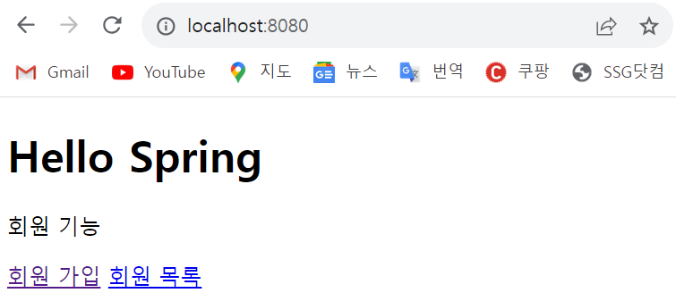
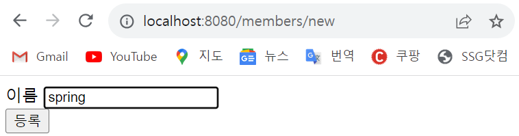
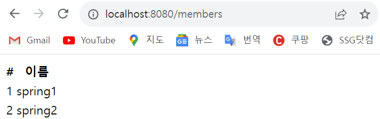

# 스프링 입문 ****- *코드로 배우는 스프링 부트, 웹 MVC, DB 접근 기술***

> ***스프링 웹 개발 기초 - SECTION 5***
>

# 5-1 회원 관리 예제 - 웹 MVC 개발

### 📍회원 웹 기능 - 홈 화면 추가

- [HomeController.java](http://HomeController.java) 전체코드

```java
package hello.hellospring.controller;

import org.springframework.stereotype.Controller;
import org.springframework.web.bind.annotation.GetMapping;

@Controller
public class HomeController {

		// localhost:8080 url의 첫 화면
    @GetMapping("/")
    public String home(){
				// home.html로 이동
        return "home";
    }
}
```

<aside>
〰️ <b><a href="/members/new">회원 가입</a>
 <a href="/members">회원 목록</a>
회원 가입 페이지 경로 - /members/new, 회원 목록 조회 페이지 경로 /members</b>
</aside>

- home.html 전체코드 [resources/templates..]

```html
<!DOCTYPE html>
<html xmlns:th="http://www.thymeleaf.org">
<body>

<div class="container">
    <div>
        <h1>Hello Spring</h1>
        <p>회원 기능</p>
        <p>
            <a href="/members/new">회원 가입</a>
            <a href="/members">회원 목록</a>
        </p>
    </div>
</div> <!-- /container -->
</body>
</html>
```


# 5-2 회원 웹 기능 - 등록

### 📍회원 등록 폼 개발

- [MemberController.java](http://MemberController.java) 추가 코드

<aside>
〰️ <b>@GetMapping("/members/new")</b><br>
public String createForm(){<br>    
<b>return "/members/createMemberForm";</b><br>
}
***회원 가입 링크를 누르면 /members/new 주소로 이동해서 resources/templates/members/createMemberForm.html 화면으로 이동함

</aside>

- createMemberForm.html 전체 코드 [resources/templates/members..]

```html
<!DOCTYPE html>
<html xmlns:th="http://www.thymeleaf.org">
<body>

<div class="container">

    <form action="/members/new" method="post">
      <div class="form-group">
        <label for="name">이름</label>
        <input type="text" id="name" name="name" placeholder="이름을 입력하세요">
      </div>
      <button type="submit">등록</button>
    </form>

</div> <!-- /container -->
</body>
</html>
```

- 웹 화면에서 이름 데이터 전달받을 form 객체를 위해 [Member.java](http://Member.java) 생성

```java
package hello.hellospring.controller;

public class MemberForm {
    // createMemberForm.html의 <input>태그 name 속성과 매칭됨
    private String name; 
    public String getName() {
        return name;
    }

    public void setName(String name) {
        this.name = name;
    }
}

```

- [MemberController.java](http://MemberController.java) 추가 코드

<aside>
〰️ <b>@PostMapping("/members/new")</b><br>
public String create(MemberForm form){<br>
Member member = new Member();    
member.setName(<b>form.getName()</b>);<br>    
memberService.join(member);    

// 홈 화면으로 이동<br>
return "redirect:/";
}

</aside>



# 5-3 회원 웹 기능 - 조회

- [MemberController.java](http://MemberController.java) 추가코드

<aside>
〰️ @<b>GetMapping("/members")</b><br>
public String List(Model model){    <Br>
List<Member> members = memberService.findMembers();<br>
model.addAttribute("members", members); <br>   
<b>return "members/memberList";</b><br>
}<br>
회원 목록 조회 링크를 누르면 members/memberList.html로 이동함

</aside>

- memberList.html 전체 코드 [resources/templates/members..]

```java
<!DOCTYPE html>
<html xmlns:th="http://www.thymeleaf.org">
<body>

<div class="container">
    <div>
        <table>
            <thead>
            <tr>
                <th>#</th>
                <th>이름</th>

            </tr>
            </thead>
            <tbody>
            <tr th:each="member : ${members}">
                <td th:text="${member.id}"></td>
                <td th:text="${member.name}"></td>
            </tr>
            </tbody>
        </table>
    </div>
</div>
</body>
</html>
```

회원 가입 페이지에서 spring1, spring2로 이름을 등록하고 회원 목록 조회 페이지로 가면 아래 사진과 같이 화면에 데이터가 나옴



<aside>
💡 참고로 현재는 Memory 리포지토리에 데이터를 잠시 저장하므로 서버를 재실행하면 데이터가 남아있지 않고 사라짐

</aside>

***다음 강의는 스프링 데이터 액세스 !!