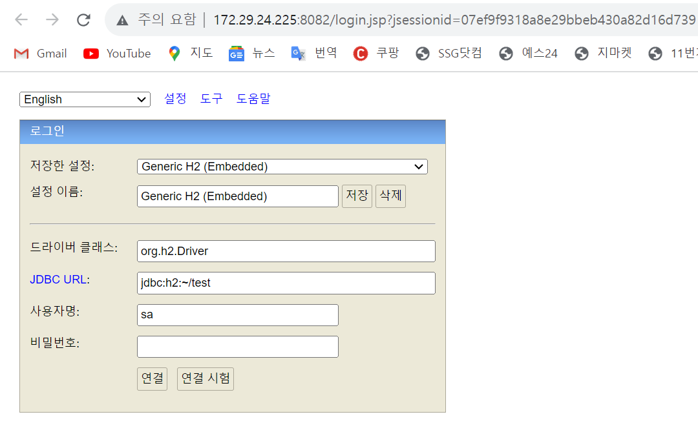
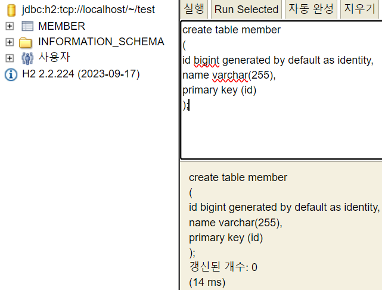
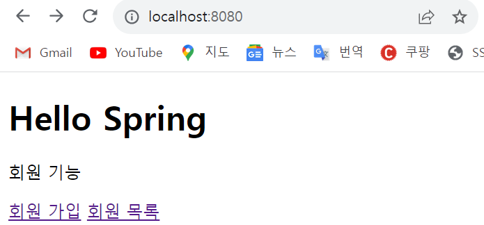
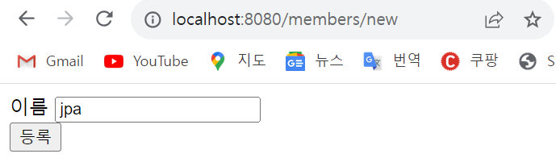
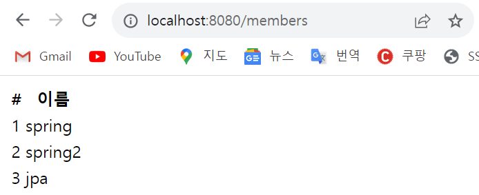
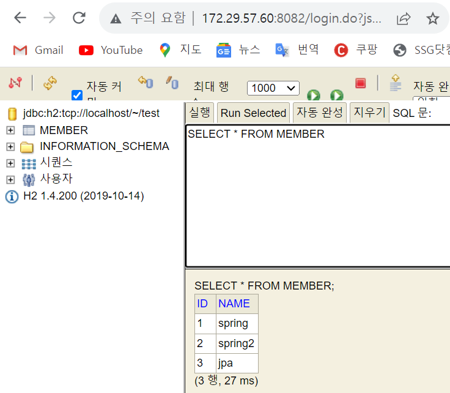
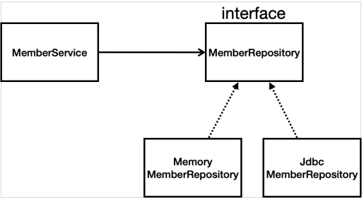
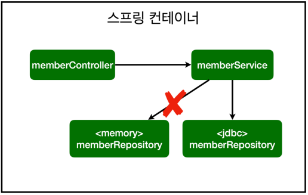

# 스프링 입문 - 코드로 배우는 스프링 부트, 웹 MVC, DB 접근 기술
 
> ***스프링 웹 개발 기초 - SECTION 6***
>

# 6-1 스프링 DB 접근 기술

### 📍H2 데이터베이스 설치

개발이나 테스트 용도로 가볍고 편리한 DB, 웹 화면 제공

- https://www.h2database.com 설치
- h2.bat 실행
- jdbc:h2:~/test (최초 한번)
- ~/test.mv.db 파일 생성 확인



- 이후에는 jdbc URL ⇒ **jdbc:h2:tcp://localhost/~/test** 수정해서 톰캣을 통해서 접근

📍**Member 테이블 만들기**

- java에서는 long, db 에서는 bigint
- generated by default as identity ⇒ 값을 세팅하지 않고 insert 하면 db에서 자동으로 id 값을 채워줌



# 6-2 순수 JDBC

📍**환경 설정**

- build.gradle 파일에 jdbc와 h2 데이터베이스 관련 라이브러리 추가

```java
```
implementation 'org.springframework.boot:spring-boot-starter-jdbc'
runtimeOnly 'com.h2database:h2'
```
java는 db와 연결되려면 jdbc가 필수로 있어야함
```

- application.properties에 데이터베이스 접속정보 작성

```java
spring.datasource.url=jdbc:h2:tcp://localhost/~/test
spring.datasource.driver-class-name=org.h2.Driver
```

MemberRepository 인터페이스를 구현하기 위해 [JdbcMemberRepository.java](http://JdbcMemberRepository.java) 생성**(20년전 고대 개발자들의 방식이므로 참고만 하기)**

```java
package hello.hellospring.Repository;

import hello.hellospring.domain.Member;
import org.springframework.jdbc.datasource.DataSourceUtils;

import javax.sql.DataSource;
import java.sql.*;
import java.util.ArrayList;
import java.util.List;
import java.util.Optional;

public class JdbcMemberRepository implements MemberRepository {

    private final DataSource dataSource;

    public JdbcMemberRepository(DataSource dataSource) {
        this.dataSource = dataSource;
    }

    @Override
    public Member save(Member member) {
        String sql = "insert into member(name) values(?)";

        Connection conn = null;
        PreparedStatement pstmt = null;
        ResultSet rs = null;

        try {
            conn = getConnection();
            pstmt = conn.prepareStatement(sql,
                    Statement.RETURN_GENERATED_KEYS);

            pstmt.setString(1, member.getName());
            pstmt.executeUpdate();

            rs = pstmt.getGeneratedKeys();
            
            if (rs.next()) {
                member.setId(rs.getLong(1));
            } else {
                throw new SQLException("id 조회 실패");
            }
            return member;
        } catch (Exception e) {
            throw new IllegalStateException(e);
        } finally {
            close(conn, pstmt, rs);
        }
    }

    @Override
    public Optional<Member> findById(Long id) {

        String sql = "select * from member where id = ?";
        Connection conn = null;
        PreparedStatement pstmt = null;
        ResultSet rs = null;
        try {
            conn = getConnection();
            pstmt = conn.prepareStatement(sql);
            pstmt.setLong(1, id);
            rs = pstmt.executeQuery();
            if(rs.next()) {
                Member member = new Member();
                member.setId(rs.getLong("id"));
                member.setName(rs.getString("name"));
                return Optional.of(member);
            } else {
                return Optional.empty();
            }
        } catch (Exception e) {
            throw new IllegalStateException(e);
        } finally {
            close(conn, pstmt, rs);
        }

    }

    @Override
    public Optional<Member> findByName(String name) {

        String sql = "select * from member where name = ?";
        Connection conn = null;
        PreparedStatement pstmt = null;
        ResultSet rs = null;
        try {
            conn = getConnection();
            pstmt = conn.prepareStatement(sql);
            pstmt.setString(1, name);
            rs = pstmt.executeQuery();
            if(rs.next()) {
                Member member = new Member();
                member.setId(rs.getLong("id"));
                member.setName(rs.getString("name"));
                return Optional.of(member);
            }
            return Optional.empty();
        } catch (Exception e) {
            throw new IllegalStateException(e);
        } finally {
            close(conn, pstmt, rs);
        }
    }

    @Override
    public List<Member> findAll() {

        String sql = "select * from member";
        Connection conn = null;
        PreparedStatement pstmt = null;
        ResultSet rs = null;
        try {
            conn = getConnection();
            pstmt = conn.prepareStatement(sql);
            rs = pstmt.executeQuery();
            List<Member> members = new ArrayList<>();
            while(rs.next()) {
                Member member = new Member();
                member.setId(rs.getLong("id"));
                member.setName(rs.getString("name"));
                members.add(member);
            }
            return members;
        } catch (Exception e) {
            throw new IllegalStateException(e);
        } finally {
            close(conn, pstmt, rs);
        }
    }

    private Connection getConnection() {
        return DataSourceUtils.getConnection(dataSource);
    }

    private void close(Connection conn, PreparedStatement pstmt, ResultSet rs)
    {
        try {
            if (rs != null) {
                rs.close();
            }
        } catch (SQLException e) {
            e.printStackTrace();
        }
        try {
            if (pstmt != null) {
                pstmt.close();
            }
        } catch (SQLException e) {
            e.printStackTrace();
        }
        try {
            if (conn != null) {
                close(conn);
            }
        } catch (SQLException e) {
            e.printStackTrace();
        }
    }

    private void close(Connection conn) throws SQLException {
        DataSourceUtils.releaseConnection(conn, dataSource);
    }
}
```

- [SpringConfig.java](http://SpringConfig.java) 설정 변경으로 수정된 코드

```java
package hello.hellospring;

import hello.hellospring.Repository.JdbcMemberRepository;
import hello.hellospring.Repository.MemberRepository;
import hello.hellospring.Repository.MemoryMemberRepository;
import hello.hellospring.service.MemberService;
import org.springframework.beans.factory.annotation.Autowired;
import org.springframework.context.annotation.Bean;
import org.springframework.context.annotation.Configuration;

import javax.sql.DataSource;

@Configuration
public class SpringConfig {
// DataSource는 데이터베이스 Connection을 획득할 때 사용하는 객체
    private DataSource dataSource;

    @Autowired
    public SpringConfig(DataSource dataSource) {
        this.dataSource = dataSource;
    }

    // 스프링 빈 등록
    @Bean
    public MemberService memberService(){
        return new MemberService(memberRepository());
    }

    @Bean
    public MemberRepository memberRepository(){
        // return new MemoryMemberRepository();

// 스프링 부트는 데이터베이스 Connection 정보를 바탕으로 DataSource를 생성하고 스프링 빈으로 만들어서 DI를 받을 수 있음
        return new JdbcMemberRepository(dataSource);
    }
}
```

스프링의 DI를 사용하면 기존 코드를 전혀 손대지 않고, 설정만으로 구현 클래스를 변경할 수 있음

- 웹 브라우저 실행



- 회원 가입 페이지에 jpa라는 이름을 등록



- 아래와 같이 DB에 저장이 잘 되었고 스프링 서버를 다시 실행해도 데이터가 안전하게 저장됨




- 현재 구현 클래스 상태와 스프링 설정 이미지





# 6-3 스프링 통합 테스트

Test도 스프링 컨테이너와 DB까지 연결해서 동작하는 **통합테스트** 진행

스프링 컨테이너한테 MemberService, MemberRepository를 받아와야 하고 test 클래스이기 때문에 필드에

<aside>
〰️ <b>@SpringBootTest</b> : 스프링 컨테이너와 테스트를 함께 실행

</aside>

<aside>
〰️ <b>@Transactional</b> : 테스트 케이스에 해당 어노테이션이 있으면, 테스트 시작 전에 transaction을 먼저 실행하고 DB에 데이터를 insert하고, 테스트가 끝나면 rollback
그래서 <b>db에 있는 실제 데이터 반영되지 않기 때문에 다음 테스트 실행 시에도 원할하게 실행될 수 있음</b>기존에 사용했던 AfterEach() 메소드로 데이터를 지우지 않아도 됨)

</aside>

- [MemberServiceIntegrationTest.java](http://MemberServiceIntegrationTest.java) 회원 서비스 스피링 통합 테스트

```java
`package hello.hellospring.service;

import hello.hellospring.Repository.MemberRepository;
import hello.hellospring.Repository.MemoryMemberRepository;
import hello.hellospring.domain.Member;
import org.assertj.core.api.Assertions;
import org.junit.jupiter.api.AfterEach;
import org.junit.jupiter.api.BeforeEach;
import org.junit.jupiter.api.Test;
import org.springframework.beans.factory.annotation.Autowired;
import org.springframework.boot.test.context.SpringBootTest;
import org.springframework.transaction.annotation.Transactional;

import static org.junit.jupiter.api.Assertions.assertThrows;

@SpringBootTest
@Transactional
class MemberServiceIntegrationTest {
    @Autowired MemberService memberService;
    @Autowired MemberRepository memberRepository;

    // build시 실제 코드에 포함되지 않으므로 코드는 한국어로 작성해서 실행해도 됨
    // 더 직관적으로 알아볼 수 있음
    @Test
    void 회원가입() {
        // given : 어떤 상황이 주어졌을 때
        Member member = new Member();
        member.setName("spring");

        // when : 실행 했을 때
        Long saveId = memberService.join(member);

        // then : 원하는 결과는 아래 코드가 나와야 함
        Member findMember = memberService.findOne(saveId).get();
        Assertions.assertThat(member.getName()).isEqualTo(findMember.getName());
    }

    @Test
    public void 중복_회원_예외() {
        // given
        Member member1 = new Member();
        member1.setName("spring");

        Member member2 = new Member();
        member2.setName("spring");
        // when

        memberService.join(member1);
        // 중복 회원 member2 객체가 join 하려면 IllegalStateException이 터져야 함
        IllegalStateException e = assertThrows(IllegalStateException.class, () -> memberService.join(member2));
        // 예외 메시지 검증
        Assertions.assertThat(e.getMessage()).isEqualTo("이미 존재하는 회원입니다.");

        // then
    }
}
```