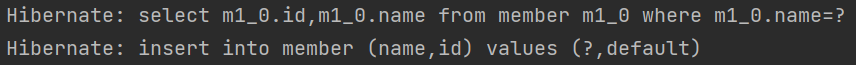
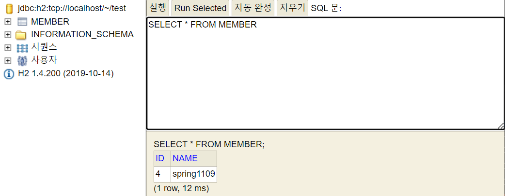

# 스프링 입문 - 코드로 배우는 스프링 부트, 웹 MVC, DB 접근 기술

> ***스프링 웹 개발 기초 - SECTION 6***
>

# 6-4 스프링 Jdbc Template

순수 Jdbc와 동일한 환경 설정이고, **스프링 JdbcTemplate 라이브러리는 JDBC API에서 본 반복 코드를 대부분 제거**해주지만 SQL은 직접 작성해야 함

<aside>
〰️  // 생성자가 1개면 Autowired 어노테이션 생략 가능<br>
 // @Autowired<br>
    public JdbcTemplateMemberRepository(DataSource dataSource){<br>
        this.jdbcTemplate = new JdbcTemplate(dataSource);<br>
    }<br>
JdbcTemplate을 사용하는 JdbcTemplateMemberRepository를 생성하고 기존에 MemberRepostiroy를 implement함

</aside>

- [JdbcTemplateMemberRepository.java](http://JdbcTemplateMemberRepository.java) 전체 코드

```java
package hello.hellospring.Repository;

import hello.hellospring.domain.Member;
import org.springframework.beans.factory.annotation.Autowired;
import org.springframework.jdbc.core.JdbcTemplate;
import org.springframework.jdbc.core.RowMapper;
import org.springframework.jdbc.core.namedparam.MapSqlParameterSource;
import org.springframework.jdbc.core.simple.SimpleJdbcInsert;

import javax.sql.DataSource;
import java.sql.ResultSet;
import java.sql.SQLException;
import java.util.HashMap;
import java.util.List;
import java.util.Map;
import java.util.Optional;

public class JdbcTemplateMemberRepository implements MemberRepository{

    private final JdbcTemplate jdbcTemplate;

    public JdbcTemplateMemberRepository(DataSource dataSource){
        this.jdbcTemplate = new JdbcTemplate(dataSource);
    }

    @Override
    public Member save(Member member) {
        SimpleJdbcInsert jdbcInsert = new SimpleJdbcInsert(jdbcTemplate);
        jdbcInsert.withTableName("member").usingGeneratedKeyColumns("id");
        Map<String, Object> parameters = new HashMap<>();
        parameters.put("name", member.getName());
        Number key = jdbcInsert.executeAndReturnKey(new
                MapSqlParameterSource(parameters));
        member.setId(key.longValue());
        return member;
    }

    @Override
    public Optional<Member> findById(Long id) {
        List<Member> result = jdbcTemplate.query("select * from member where id = ?", memberRowMapper(), id);
        return result.stream().findAny();
    }

    @Override
    public Optional<Member> findByName(String name) {
        List<Member> result = jdbcTemplate.query("select * from member where name = ?", memberRowMapper(), name);
        return result.stream().findAny();
    }

    @Override
    public List<Member> findAll() {
        return jdbcTemplate.query("select * from member", memberRowMapper());
    }

    private RowMapper<Member> memberRowMapper(){
        return (rs, rowNum) -> {
            Member member = new Member();
            member.setId(rs.getLong("id"));
            member.setName(rs.getString("name"));
            return member;
        };
    }
}
```

- JdbcTemplate을 사용하도록 스프링 설정 변경한 [SpringConfig.jav](http://SpringConfig.java)a 추가 코드

```java
package hello.hellospring;

```java

@Configuration
public class SpringConfig {
	private DataSource dataSource;
	@Bean
	    public MemberRepository memberRepository(){
	        // return new MemoryMemberRepository();
	        //return new JdbcMemberRepository(dataSource);
	        return new JdbcTemplateMemberRepository(dataSource);
	    }
}
```

# 6-5 JPA

JPA : JAVA 진영의 표준 인터페이스,
ORM(Object Relational Mapping) 기술 = 객체와 DB 테이블을  매핑함

<aside>
💡 <b>JPA</b>를 사용하면 기존의 반복 코드는 물론이고, <b>SQL 쿼리문도 자동으로 처리해서 실행해줌</b> ⇒ 개발 생산성을 크게 높일 수 있음<br>
SQL과 데이터 중심의 설계 ⇒ <b>객체 중심의 설계로 패러다임을 전환</b>할 수 있음

</aside>

### 📍JPA 사용

1. build.gradle JPA 라이브러리 추가

<aside>
〰️ //  implementation 'org.springframework.boot:spring-boot-starter-jdbc'   
<b>>implementation 'org.springframework.boot:spring-boot-starter-data-jpa'</b><br>
JPA 사용을 위해 build.gradle에서 **spring-boot-starter-data-jpa** 추가
이는 jdbc 관련 라이브러리를 포함하고 있으므로, 기존의 jdbc 라이브러리는 제거(주석으로 처리)

</aside>

2. resources/application.properties JPA 설정 추가

<aside>
〰️ <b>spring.jpa.show-sql=true</b><br>
JPA가 생성하는 SQL문 확인 가능

**spring.jpa.hibernate.ddl-auto=none**
테이블을 자동으로 생성하는 기능을 제공하지만, 현재는 만들어논 MEMBER 테이블이 있으므로 none을 사용해서 테이블 자동 생성 기능 끔(create를 사용하면 자동으로 생성)

</aside>

3. JPA 사용을 위해 엔티티 매핑(Entity Mapping)

<aside>
〰️ <b>@Entity</b> : JPA가 관리하는 엔티티<br>
<b>@Id</b> : PK(Primary Key)<br>
<b>GenerationType.IDENTITY</b> : DB에 값을 추가하면 DB에서 id를 자동으로 생성해줌

</aside>

- [Member.java](http://Member.java) 추가 코드

```java
package hello.hellospring.domain;

import jakarta.persistence.Entity;
import jakarta.persistence.GeneratedValue;
import jakarta.persistence.GenerationType;
import jakarta.persistence.Id;

@Entity
public class Member {
    //PK = @Id
    @Id @GeneratedValue(strategy = GenerationType.IDENTITY)
    private Long id;
    private String name;
}
```

4. JPA 회원 리포지토리 생성

<aside>
〰️ <b>private final EntityManager em;</b>

public JpaMemberRepository(EntityManager em) {<br>    
this.em = em;

}<br>
JPA는 EntityManager를 사용해서 모두 동작됨

</aside>

- PK를 이용해서 저장, 조회

<aside>
〰️ @Override<br>
public Member save(Member member) {<br>    
<b>em.persist(member);</b><br>    
return member;<br>
}<br>
em.persist(member) ⇒ JPA가 insert 쿼리를 생성하고 setId()까지 자동으로 처리함
</aside>
<br>
<aside>
〰️ @Override<br>
public Optional<Member> findById(Long id) {<br>    
Member member = <b>em.find(Member.class, id);<br>    
return Optional.ofNullable(member);</b><br>
}<br>
<b>em.find(조회할 타입, 식별자(PK)) 입력</b>하면 조회 가능

</aside>

- PK가 아닌 속성들의 조회는 jpql(⇒테이블 대상이 아닌 객체(entity)를 대상으로 쿼리문 요청하면 JPA에 의해 SQL로 변환됨)

<aside>
〰️ @Override<br>
public Optional<Member> findByName(String name) {<br>    
List<Member> result = <b>em.createQuery("select m from Member m where m.name = :name", Member.class)<br>            
.setParameter("name", name)<br>            
.getResultList();</b><br>    
return result.stream().findAny();<br>
}

</aside>

<aside>
〰️ @Override<br>
public List<Member> findAll() {<br>    
return <b>em.createQuery("select m from Member m", Member.class)<br>            
.getResultList();</b><br>
}

</aside>

- JpaMemberReposity.java

```java
package hello.hellospring.Repository;

import hello.hellospring.domain.Member;
import jakarta.persistence.EntityManager;

import java.util.List;
import java.util.Optional;

public class JpaMemberRepository implements MemberRepository{

    private final EntityManager em;

    public JpaMemberRepository(EntityManager em) {
        this.em = em;
    }

    @Override
    public Member save(Member member) {
        em.persist(member);
        return member;
    }

    @Override
    public Optional<Member> findById(Long id) {
        Member member = em.find(Member.class, id);
        return Optional.ofNullable(member);
    }

    @Override
    public Optional<Member> findByName(String name) {
        List<Member> result = em.createQuery("select m from Member m where m.name = :name", Member.class)
                .setParameter("name", name)
                .getResultList();
        return result.stream().findAny();
    }

    @Override
    public List<Member> findAll() {
        return em.createQuery("select m from Member m", Member.class)
                .getResultList();
    }
}
```

5. 서비스 계층에 트랜잭션 추가
- **데이터를 저장하거나 변경 시에는 @Transactional 필요하므로 [MemberService.java](http://MemberService.java)에 작성**

<aside>
〰️ <b>@Transactional</b><br>
public class MemberService {}

<aside>
💡 <b>PA는 모든 데이터 변경이 transaction 안에서 실행돼야함</b>

</aside>

</aside>

6. JPA 사용하도록 스프링 설정 변경
- [SpringConfig.java](http://SpringConfig.java) 추가 코드

<aside>
💡 public class SpringConfig {<br>    
<b>private EntityManager em;</b><br>     
<b>@Autowired<br>     
public SpringConfig(EntityManager em) {<br>        
 this.em = em;</b><br>  
}<br> 
기존의 DataSoure 부분을 지우고 JPA 사용을 위해 EntityManager 추가

@Bean
public MemberRepository memberRepository(){<br>     
<b>return new JpaMemberRepository(em);</b><br>
}<br>
JPA로 만든 리포지토리 리턴
}

</aside>

7. 스프링 통합 테스트 실행

**Hibernate라는 오픈소스 구현체**가 사용되어서 **SQL 쿼리 문으로 전환**되어 DB와 연결됨



회원가입 메소드에서 member.setName("spring1109")으로 설정한 대로 데이터 저장됨

