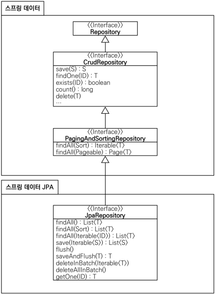
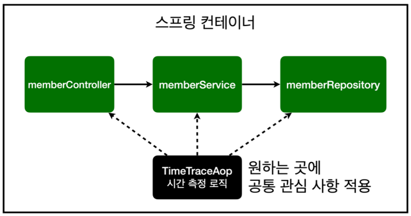
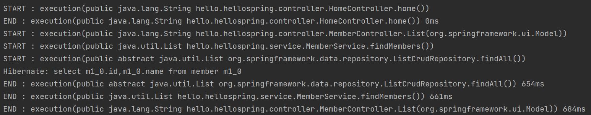
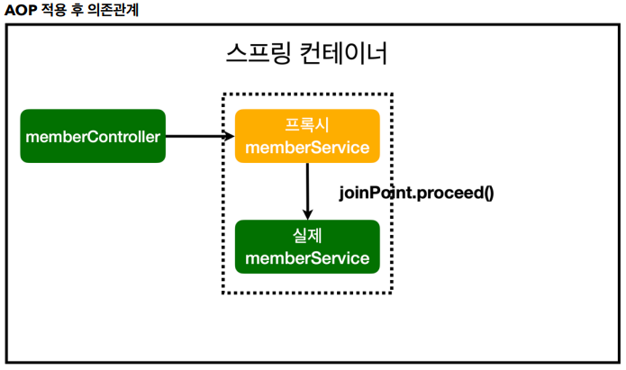

# 스프링 입문 - 코드로 배우는 스프링 부트, 웹 MVC, DB 접근 기술
 
> ***스프링 웹 개발 기초 - SECTION 6,7***
>
### <2023-11-11>
# 6-5 스프링 데이터 JPA

스프링 부트와 JPA만 사용해도 개발 생산성이 정말 많이 증가하고, 개발해야할 코드도 확연히 줄어듬. 여기에 스프링 데이터 JPA를 사용하면, 기존의 한계를 넘어 마치 마법처럼, 리포지토리에 구현 클래스 없이 인터페이스 만으로 개발을 완료할 수 있음. 그리고 반복 개발해온 기본 CRUD 기능도 스프링 데이터 JPA가 모두 제공함. 스프링 부트와 JPA라는 기반 위에, 스프링 데이터 JPA라는 환상적인 프레임워크를 더하면 개발이 정말 즐거워지고, 지금까지 조금이라도 단순하고 반복이라 생각했던 개발 코드들이 확연하게 줄어듬. 따라서 개발자는 핵심 비즈니스 로직을 개발하는데, 집중할 수 있음.
실무에서 관계형 데이터베이스를 사용한다면 스프링 데이터 JPA는 이제 선택이 아니라 필수 !!

<aside>
🚨 스프링 데이터 JPA는 JPA를 편리하게 사용하도록 도와주는 기술이어서 <b>JPA를 먼저 학습한 후에 스프링 데이터 JPA를 학습해야 함</b>

</aside>

- interface가 interface를 상속 받을 때는 extends 사용하고, 다중 상속이 가능함
- 스프링 데이터 JPA 회원 리포지토리

```java
package hello.hellospring.Repository;

import hello.hellospring.domain.Member;
import org.springframework.data.jpa.repository.JpaRepository;

import java.util.Optional;

public interface SpringDataJpaMemberRepository extends JpaRepository<Member, Long>, MemberRepository {

    @Override
    Optional<Member> findByName(String name);
}
```

- **스프링 데이터 JPA가 SpringDataJpaMemberRepository 를 스프링 빈으로 자동 등록**
- 스프링 데이터 JPA 회원 리포지토리를 사용하도록 스프링 설정 변경을 위한 [SpringConfig.java](http://SpringConfig.java) 추가 코드

```java
@Configuration
public class SpringConfig {
    private final MemberRepository memberRepository;

    public SpringConfig(MemberRepository memberRepository) {
        this.memberRepository = memberRepository;
    }

    // 스프링 빈 등록
    @Bean
    public MemberService memberService(){

        return new MemberService(memberRepository);
    }
}
```

📍**스프링 데이터 JPA 제공 기능**

- 인터페이스를 통한 기본적인 CRUD
- findByName() , findByEmail() 처럼 메서드 이름 만으로 조회 기능 제공
- 페이징 기능 자동 제공



# 7-1 AOP

### 📍AOP가 필요한 상황

- 모든 메소드의 호출 시간을 측정하고 싶다면?
- 공통 관심 사항(cross-cutting concern) vs 핵심 관심 사항(core concern)
- 회원 가입 시간, 회원 조회 시간을 측정하고 싶다면?

<aside>
🚨 <b>문제</b>

- 회원 가입, 회원 조회에 시간을 측정하는 기능은 핵심 관심 사항이 아닌 **공통 관심 사항**임
- 시간을 측정하는 로직과 핵심 비즈니스 로직이 섞여서 유지 보수가 어려움
- 시간을 측정하는 로직을 변경할 때 모든 로직을 찾아가면서 변경해야 함
</aside>

# 7-2 AOP 적용

- AOP : Aspect Oriented Programming
- 공통 관심 사항 vs 핵심 관심 사항 분리해서 시간 측정 로직을 따로 만들고 원하는 곳에 이를 적용



- TimeTraceAop 클래스 생성

<aside>
〰️ // @Aspect 어노테이션 사용해서 AOP 적용<br>
<b>@Aspect</b>

@Component  (대신 직접 등록하는 사용방식을 선호)

public class TimeTraceAop {}

</aside>

<aside>
〰️ <b>@Around("execution(* hello.hellospring..*(..))")</b><br>
hellospring 패키지 하위에는 공통 관심 사항 모두 적용

</aside>

- [TimeTraceAop.java](http://TimeTraceAop.java) 전체코드

```java
package hello.hellospring.aop;

import org.aspectj.lang.ProceedingJoinPoint;
import org.aspectj.lang.annotation.Around;
import org.aspectj.lang.annotation.Aspect;
import org.springframework.stereotype.Component;

@Aspect
@Component
public class TimeTraceAop {

    @Around("execution(* hello.hellospring..*(..))")
    public Object execute(ProceedingJoinPoint joinPoint) throws Throwable {
        long start = System.currentTimeMillis();

        //어떤 메소드를 호출하는지 알 수 있음
        System.out.println("START : " + joinPoint.toLongString());
        try{
            return joinPoint.proceed();
        } finally {
            long finish = System.currentTimeMillis();
            long timeMs = finish - start;
            System.out.println("END : " + joinPoint.toLongString() + " " + timeMs + "ms");
        }
    }
}
```

웹 브라우저 실행 후 메소드가 호출될 때마다 시간이 측정되는 것을 확인할 수 있음



<aside>
💡 <b>해결</b>

- 회원 가입, 회원 조회 등 핵심 관심 사항과 시간을 측정하는 공통 관심 사항을 분리함
- 시간을 측정하는 로직을 별도의 공통 로직으로 만듬
- 핵심 관심 사항을 깔끔하게 유지 가능
- 변경이 필요하면 이 로직만 변경하면 됨
- 원하는 적용 대상을 선택할 수 있음
</aside>

- helloController가  호출하는 것은 실제 memberService가 아닌 프록시 기술로 발생하는 가짜 memberService 호출
- 가짜 memberService 끝나면 joinPoint.proceed() 발생해서 그 때 실제 memberService가 발생됨

